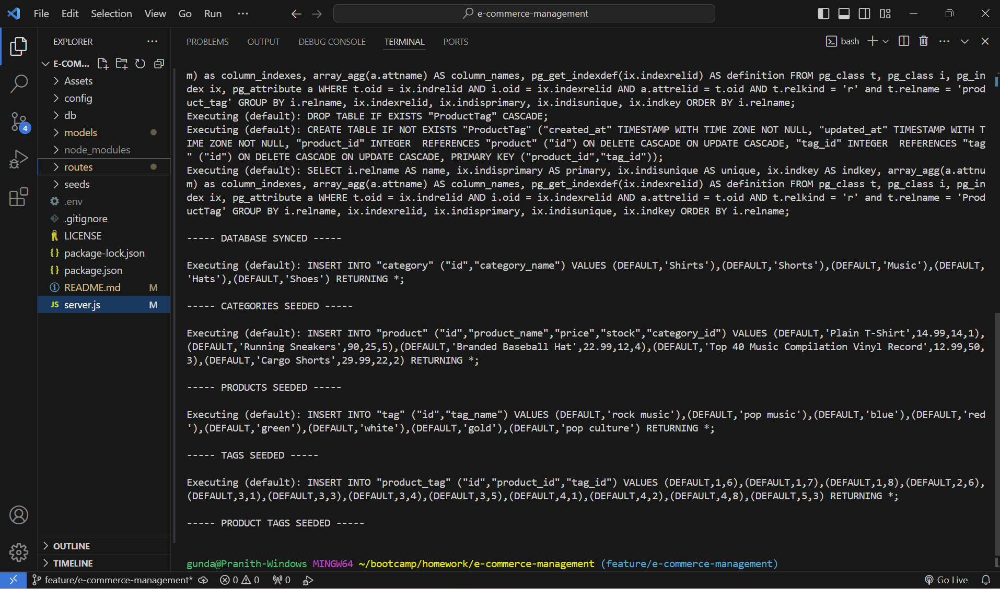
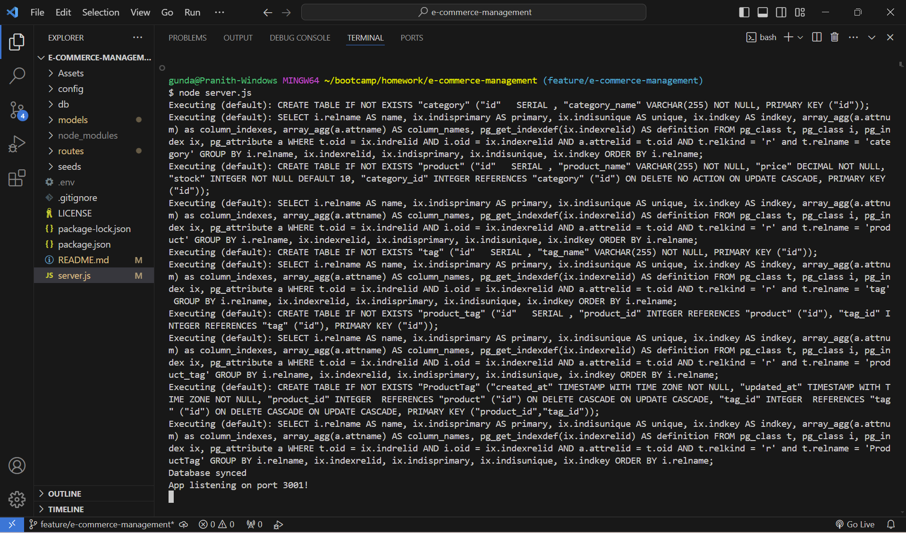

# E-COMMERCE-MANAGEMENT

## Description

E-Commerce-Management application is built to manage inventory of e-commerce site. This application lets you manage the inventory through the APIs exposed. Using the APIs, the Products that belong to e-commerce site can be maintained along with the categories and tags the product belongs to. The application also lets you to create new products, categories and tags by performing real time operations.

The application exposes APIs through Express.js that leverage sequelize to interact with PostgreSQL database.

## Screenshots

## Link To Video Demonstration

https://drive.google.com/file/d/1ToBn7hPMoghARleOKqvqMUBtXWxy1pie/view